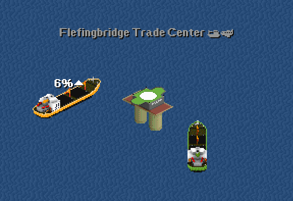

# Trade Center

A neutral free trade center for multiplayer OpenTTD games. Trade resources or connect CargoDist networks here.

Note: Vanilla OpenTTD does not pay multi-company deliveries properly — the delivering company gets paid for the entire trip, and other companies involved get nothing (despite transfer credits saying otherwise). 

This is somewhat mitigated by passenger networks using symmetrical CargoDist being roughly balanced in both directions, but other cargos are intended for strategic trade ("You have Steel, I have Engineering Supplies. Let's trade.") rather than making money.
